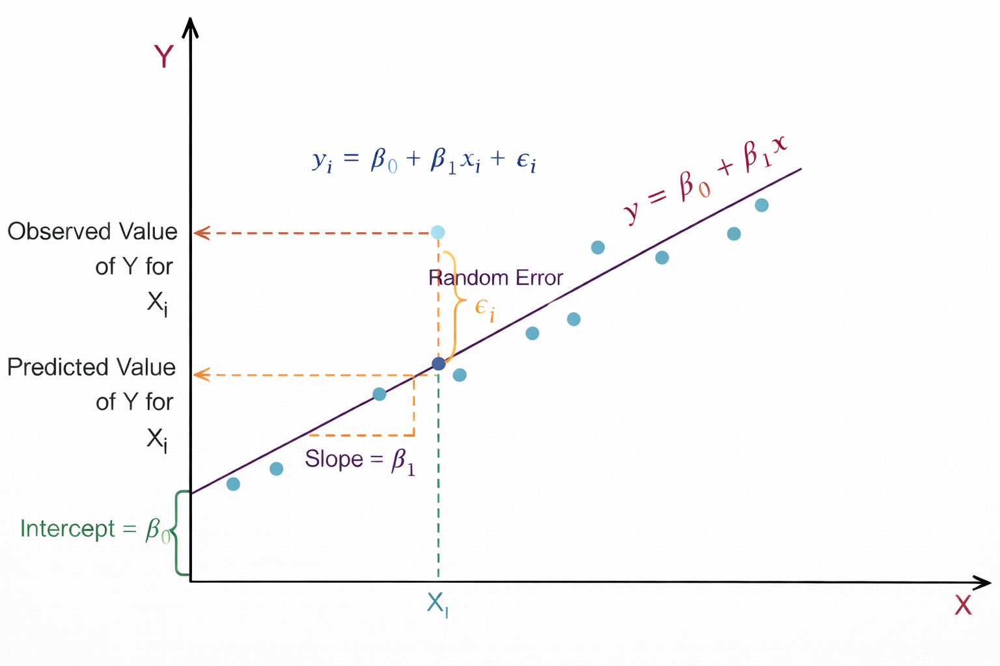
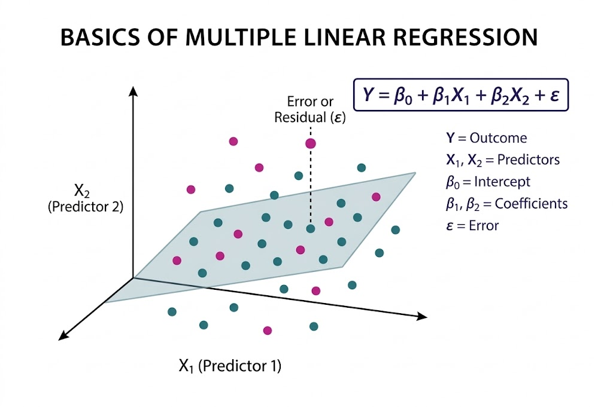
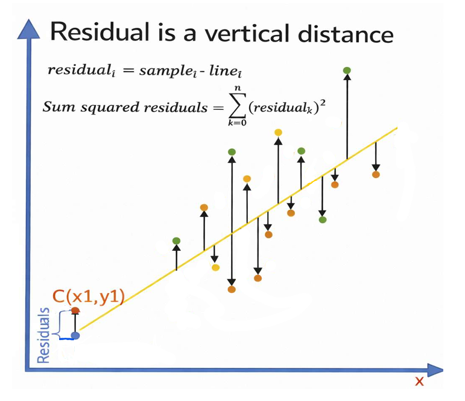

Linear Regression is one of the most fundamental and widely used algorithms in Machine 
Learning and Statistical Modelling. It belongs to the category of supervised learning algorithms, 
where the model is trained using labelled data that contains both input variables (features) and 
the corresponding output variable (target). 

The goal of Linear Regression is to identify and quantify the relationship between variables so 
that future outcomes can be predicted. The algorithm assumes that the relationship between the 
dependent variable and independent variables can be approximated using a linear equation. 

For example, linear regression can be used to model relationships such as House price 
prediction based on area and number of rooms, Sales prediction based on advertising 
expenditure, Student performance prediction based on study hours, and Once the model learns 
the relationship from historical data, it can be used to predict continuous numerical values for 
new input data.

### 1. Simple Linear Regression

Simple Linear Regression models the relationship between one independent variable (X) and 
one dependent variable (Y). The objective is to find the best-fitting straight line, known as the 
regression line, that represents the relationship between the two variables. 

The regression line is determined using the equation: 

   
      <i>Y</i> = <i>&beta;</i>0 + <i>&beta;</i>1<i>X</i> + <i>&epsilon;</i>
   

This line represents the predicted value of Y for a given value of X. 

Figure 1: Linear regression showing slope, intercept, and prediction error.

As shown in Figure 1, the relationship between the independent variable <i>X</i> and the dependent variable <i>Y</i> is represented using a linear regression model. The straight line <i>y</i> = <i>&beta;</i>0 + <i>&beta;</i>1<i>x</i> represents the regression line, which predicts the value of <i>Y</i> for a given value of <i>X</i>. Here, <i>&beta;</i>0 is the intercept, which indicates the value of <i>Y</i> when <i>X</i> = 0, and <i>&beta;</i>1 represents the slope of the line, showing how much <i>Y</i> changes for a unit change in <i>X</i>. The light blue points in the graph represent the actual observed data points. For a particular value <i>X</i>i, the model predicts a value of <i>Y</i> on the regression line, known as the predicted value, while the actual data point represents the observed value. The vertical distance between these two values is called the random error or residual <i>&epsilon;</i>i. 

This residual shows the difference between the predicted value given by the model and the actual observed value. The dashed lines in the graph help visualize the observed value, predicted value, and the slope of the regression line, illustrating how linear regression fits a line that best represents the overall trend of the data.

### 2. Multiple Linear Regression

Multiple Linear Regression extends the concept of simple linear regression by considering two 
or more independent variables to predict the dependent variable. This allows the model to 
capture more complex relationships in the data where multiple factors influence the outcome. 

The general equation of multiple linear regression is:

   
      <i>Y</i> = <i>&beta;</i>0 + <i>&beta;</i>1<i>X</i>1 + <i>&beta;</i>2<i>X</i>2 + ... + <i>&beta;</i>n<i>X</i>n + <i>&epsilon;</i>
   

Each coefficient represents the contribution of a specific feature to the predicted value, while 
keeping other variables constant. 

where,
- Y: Dependent variable (target)
- X1, X2, ..., Xn: Independent variables (features)
- &beta;0: Intercept
- &beta;1, &beta;2, ..., &beta;n: Regression coefficients
- &epsilon;: Error term (residual)

Figure 2: Multiple linear regression showing the regression plane and residual error.

As illustrated in Figure 2, Multiple Linear Regression is a statistical technique used to model the relationship between two or more independent variables and a single dependent variable by fitting a best-fit plane through a three-dimensional scatter plot of data points. The model is expressed as <i>Y</i> = <i>&beta;</i>0 + <i>&beta;</i>1<i>X</i>1 + <i>&beta;</i>2<i>X</i>2 + <i>&epsilon;</i>, where <i>Y</i> represents the dependent variable, <i>X</i>1 and <i>X</i>2 are the predictors, <i>&beta;</i>0 is the intercept, <i>&beta;</i>1 and <i>&beta;</i>2 are the coefficients corresponding to each predictor, and <i>&epsilon;</i> denotes the error term.

The fitted plane represents the predicted values of the dependent variable; however, the actual data points generally do not lie exactly on this plane. The vertical distance between an observed data point and the plane, indicated by the dashed line, is known as the residual or error. The objective of the model is to minimize these residuals, thereby improving prediction accuracy. This approach enables the model to quantify the contribution of each independent variable and helps in understanding how different predictors influence the outcome.

### 3. Method of Least Squares

The parameters of the regression model (β₀ and β₁) are estimated using the Least Squares 
Method. The main idea of this method is to determine the regression line that minimizes the 
total prediction error.

The error is measured using the Residual Sum of Squares (RSS), which is calculated as the sum 
of squared differences between the observed values and the predicted values.

   
      <i>RSS</i> = 
      

         
<i>n</i>

         
&sum;

         
<i>i</i>=1

      

      (<i>Y</i>i − <i>ŷ</i>i)2
   

where,
- Yi: actual value
- y&#770;i: predicted value

By minimizing RSS, the algorithm finds the best possible line that fits the data points.

Figure 3: Residuals as vertical distances between observed points and the regression line.

Figure 3 illustrates the concept of residuals in linear regression. The X-axis represents the independent variable <i>x</i>, while the Y-axis represents the dependent variable <i>y</i>. The slanted line shown in the figure is the regression line, which represents the predicted relationship between <i>x</i> and <i>y</i>. The scattered colored points represent the actual observed data points. For each data point, a vertical arrow is drawn between the observed value and the regression line. This vertical distance is called the residual, which represents the difference between the actual observed value and the predicted value given by the regression model. Mathematically, the residual is expressed as <i>residual</i>i = <i>sample</i>i − <i>line</i>i. The figure also shows the formula for the Sum of Squared Residuals (SSR), &sum;(<i>residual</i>k)2, which is used in linear regression to measure how well the regression line fits the data. A smaller sum of squared residuals indicates a better fit of the model to the observed data. The point labeled <i>C</i>(<i>x</i>1, <i>y</i>1) demonstrates a specific example where the vertical difference between the observed point and the predicted point on the regression line represents the residual.

### 4. Interpretation of Regression Coefficients

The coefficients in a regression model provide meaningful insights into the relationship 
between variables. 

- **Intercept (&beta;0):**  Represents the value of the dependent variable when all independent 
variables are zero.

- **Slope(&beta;1):** Indicates how much the dependent variable changes when the independent 
variable increases by one unit.

- **Regression coefficients (&beta;1, &beta;2, ...):** Strength and direction of influence of each feature.

For example, if <i>&beta;</i>1 = 2, then for one-unit increase in <i>X</i>, predicted <i>Y</i> increases by 2 units (all else constant).

### 5. Algorithm

**Step 1:** Let <i>X</i> be the input features and (<i>Y</i>) be output values.

**Step 2:** Assume a linear relationship:

   
      <i>y</i> = <i>&beta;</i>0 + <i>&beta;</i>1<i>x</i>1 + <i>&beta;</i>2<i>x</i>2 + ... + <i>&beta;</i>n<i>x</i>n
   

- <i>&beta;</i>0 is the intercept (value when all <i>x</i> = 0)

- <i>&beta;</i>1, <i>&beta;</i>2, ... are coefficients (weights) for each feature

**Step 3:** Define the error (residual) for each data point:
- Error = Actual value - Predicted value

- 

   
      <i>e</i>i = <i>y</i>i - (<i>&beta;</i>0 + <i>&beta;</i>1<i>x</i>1i + <i>&beta;</i>2<i>x</i>2i + ...)
   

**Step 4:** Calculate total error using Sum of Squared Errors (SSE):

- 

   
      <i>SSE</i> = 
      

         
<i>n</i>

         
&sum;

         
<i>i</i>=1

      

      (<i>e</i>i)2 = 
      

         
<i>n</i>

         
&sum;

         
<i>i</i>=1

      

      (<i>y</i>i − <i>ŷ</i>i)2
   

**Step 5:** Find coefficients that minimize SSE using Normal Equation:

- 

   
      <i>&beta;</i> = (<i>X</i>T<i>X</i>)-1<i>X</i>T<i>y</i>
   

- Where <i>X</i> is the feature matrix and <i>Y</i> is the target vector

**Step 6:** For new data, predict using:

- 

   
      <i>ŷ</i> = <i>&beta;</i>0 + <i>&beta;</i>1<i>x</i>1 + <i>&beta;</i>2<i>x</i>2 + ... + <i>&beta;</i>n<i>x</i>n
   

### 6. Assumptions of Linear Regression

- **Linearity:** The relationship between independent and dependent variables is linear
- **Independence:** Observations are independent of each other.
- **Homoscedasticity:** Constant variance of residuals across all values of X.
- **Normality:**  Residuals are normally distributed.

### 7. Applications of Linear Regression

Linear Regression is widely used in many real-world applications, including:

- Sales forecasting
- Price prediction
- Risk assessment
- Demand estimation
- Economic trend analysis
- Healthcare data analysis

Due to its simplicity and interpretability, linear regression is often used as a baseline model in 
many machine learning problems.

### 8. Merits of Linear Regression

- **Simplicity and interpretability:**  Linear Regression is easy to understand and 
implement. Model coefficients have clear statistical meaning, indicating the magnitude 
and direction of feature influence on the target variable
- **Effective for Linearly Related Data:** Performs well when the true relationship 
between features and target is approximately linear and assumptions are reasonably 
satisfied.

### 9. Demerits of Linear Regression

- **Linearity Assumption:** The model cannot capture non-linear relationships unless 
manual feature transformations (e.g., polynomial terms) are applied.
- **Sensitivity to Outliers:** Least Squares estimation squares residuals, giving excessive 
weight to outliers, which can significantly distort the model.
- **Multicollinearity issues:** High correlation among independent variables leads to 
unstable coefficient estimates and reduced interpretability in Multiple Linear 
Regression.

