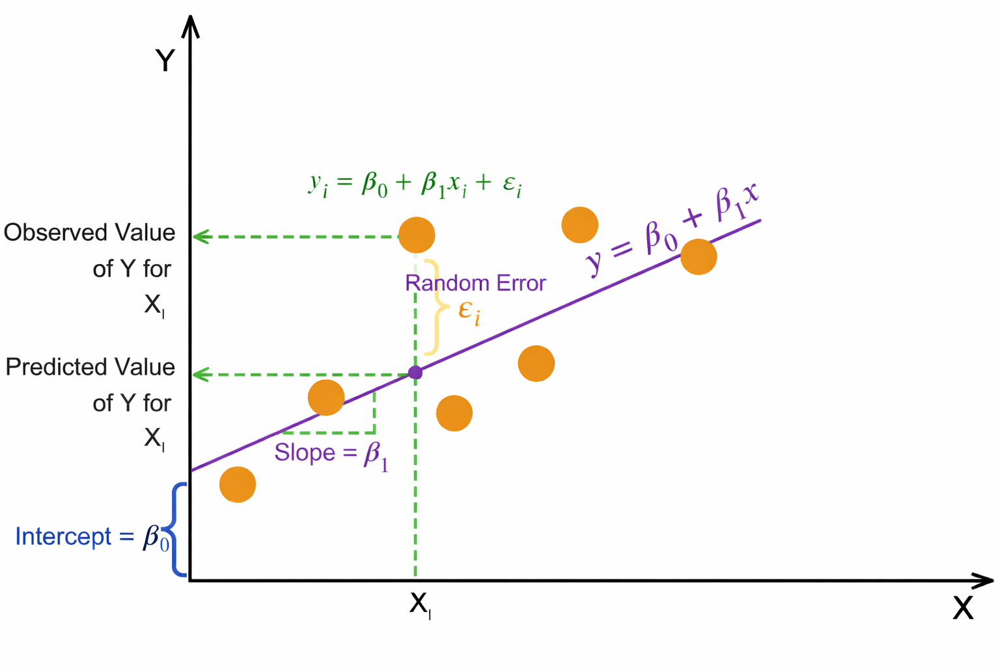

Linear Regression is a supervised machine learning algorithm used to model the relationship between a dependent (target) variable and one or more independent (feature) variables by fitting a linear equation to observed data. The objective is to predict continuous numerical outcomes.

#### 1. Simple Linear Regression

Simple Linear Regression involves a single independent variable and is mathematically expressed as:

Y = β₀ + β₁X + ε

#### 2. Multiple Linear Regression

Multiple Linear Regression involves two or more independent variables and is expressed as:

Y = β₀ + β₁X₁ + β₂X₂ + ⋯ + βₙXₙ + ε

Where:
- **Y:** Dependent variable (Target)
- **X:** Independent variable(s) (Features)
- **β₀:** Intercept
- **β₁, β₂, …, βₙ:** Regression coefficients
- **ε:** Error term (residual)

#### 3. Method of Least Squares

The coefficients of the regression model are estimated using the Least Squares Method, which minimizes the Residual Sum of Squares (RSS)—the sum of squared differences between observed and predicted values.

#### 4. Assumptions of Linear Regression

- **Linearity** – The relationship between independent and dependent variables is linear.
- **Independence** – Observations are independent of each other.
- **Homoscedasticity** – Constant variance of residuals across all values of X.
- **Normality** – Residuals are normally distributed.

#### 5. Merits of Linear Regression

- **Simplicity and Interpretability:** Linear Regression is easy to understand and implement. Model coefficients have clear statistical meaning, indicating the magnitude and direction of feature influence on the target variable.
- **Effective for Linearly Related Data:** Performs well when the true relationship between features and target is approximately linear and assumptions are reasonably satisfied.

#### 6. Demerits of Linear Regression

- **Linearity Assumption:** The model cannot capture non-linear relationships unless manual feature transformations (e.g., polynomial terms) are applied.
- **Sensitivity to Outliers:** Least Squares estimation squares residuals, giving excessive weight to outliers, which can significantly distort the model.
- **Multicollinearity Issues:** High correlation among independent variables leads to unstable coefficient estimates and reduced interpretability in Multiple Linear Regression.

#### 7. Algorithm

- **Step 1:** Let X be the input features and (Y) be output values
- **Step 2:** Assume a linear relationship: `y = β₀ + β₁x₁ + β₂x₂ + ... + βₙxₙ`
    - β₀ is the intercept (value when all x = 0)
    - β₁, β₂, ... are coefficients (weights) for each feature
- **Step 3:** Define the error (residual) for each data point:
    - Error = Actual value - Predicted value
    - `eᵢ = yᵢ - (β₀ + β₁x₁ᵢ + β₂x₂ᵢ + ...)`
- **Step 4:** Calculate total error using Sum of Squared Errors (SSE):
    - `SSE = Σ(eᵢ)² = Σ(yᵢ - ŷᵢ)²`
- **Step 5:** Find coefficients that minimize SSE using Normal Equation:
    - `β = (XᵀX)⁻¹Xᵀy`
    - Where X is the feature matrix and y is the target vector
- **Step 6:** For new data, predict using:
    - `ŷ = β₀ + β₁x₁ + β₂x₂ + ... + βₙxₙ`

